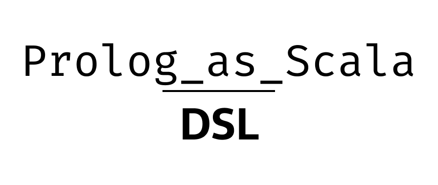

# Prolog as Scala DSL

<p style="text-align: center">

</p>

Prolog-as-scalaDSL is a library providing a DSL for writing Prolog programs in scala.

## How to use

1. Add the following library dependency in your build file.
   * for sbt:
     ```scala
      libraryDependencies += "io.github.kelvindev15" % "prolog-as-scaladsl_3" % "<version>"
     ```
   * for gradle:
     ```kotlin
     implementation("io.github.kelvindev15:prolog-as-scaladsl_3:<version>")
     ```
2. Replace `<version>` with the desired of latest version of the library.

## Demo
Using the DSL is as simple as extending the `PrologDSL` trait. Let's write a program.

```scala 3
object Demo extends PrologDSL:
  def main(args: Array[String]): Unit =
    val program = PrologProgram(Theory(
      factOf(structOf(atomOf("father"), atomOf("abraham"), atomOf("isaac"))),
      factOf(structOf(atomOf("father"), atomOf("terach"), atomOf("abraham"))),
      ruleOf(
        structOf(atomOf("grandfather"), varOf("X"), varOf("Y")),
        structOf(atomOf("father"), varOf("X"), varOf("Z")) and
          structOf(atomOf("father"), varOf("Z"), varOf("Y")))),
    )

    for
      solution <- Solver solve (
        program withGoal structOf(atomOf("father"), atomOf("abraham"), atomOf("isaac")))
    do println(solution)
```

Here's the output:

```text
Yes(father(abraham, isaac),Map())
```

As you can tell the writing of the prolog program is a bit difficult since we had to specify what is a struct, what 
is an atom or a variable, etc... Fortunately we are in scala so we can take advantage of that:

```scala 3
val father = atomOf("father")
val grandfather = atomOf("grandfather")
val abraham = atomOf("abraham")
val isaac = atomOf("isaac")
val terach = atomOf("terach")
val X = varOf("X")
val Y = varOf("Y")
val Z = varOf("Z")

val program = PrologProgram(Theory(
  factOf(structOf(father, abraham, isaac)),
  factOf(structOf(father, terach, abraham)),
  ruleOf(structOf(grandfather, X, Y), structOf(father, X, Z) and structOf(father, Z, Y))),
)
```
Now the program was easier to write, but, still we had to introduce a lot of variables in order to achieve that.
Luckily the DSL come with some of predefined structures such as variables and moreover strings are automatically converted
to atoms!

```scala 3
val program = PrologProgram(theory(
  factOf(structOf("father", "abraham", "isaac")),
  factOf(structOf("father", "terach", "abraham")),
  ruleOf(structOf("grandfather", X, Y), structOf("father", X, Z) and structOf("father", Z, Y))),
)
```

In order to resemble the prolog syntax, string can be invoked to create structures:

```scala 3
val program = PrologProgram(theory(
  factOf("father"("abraham", "isaac")),
  factOf("father"("terach", "abraham")),
  ruleOf("grandfather"(X, Y), "father"(X, Z) and "father"(Z, Y)),
))
```

The grandfather rule can be written in a "more prolog" way as:

```scala 3
"grandfather"(X, Y) :- ("father"(X, Z) &: "father"(Z, Y))
```

Whenever a clause is expected (e.g the arguments of the theory method), structure are automatically converted to fact.
So here's a cleaner way to write the program.

```scala 3
val program = PrologProgram(theory(
  "father"("abraham", "isaac"),
  "father"("terach", "abraham"),
  "grandfather"(X, Y) :- ("father"(X, Z) &: "father"(Z, Y)))
)
```

Let's make some other queries:

```scala 3
for
  goal <- Seq(
    "grandfather"("abraham", "isaac"),
    "father"(A, "isaac"),
    "father"(F, S)
  )
  solution <- Solver solve (program withGoal goal)
do println(solution)

/* OUTPUT:
 No(grandfather(abraham, isaac))
 Yes(father(A, isaac),Map(A -> abraham))
 Yes(father(F, S),Map(F -> abraham, S -> isaac))
 Yes(father(F, S),Map(F -> terach, S -> abraham))
*/
```

As you can see some solutions have a mapping (substitution). In this cases we can access a variable substitution directly
from the solution:

```scala 3
for
  solution <- Solver solve (program withGoal "father"(F, S))
do
  for
    father <- solution(F)
    son <- solution(S) 
  do println(s"$father is the father of $son")
  
/* OUTPUT
 abraham is the father of isaac
 terach is the father of abraham
 */
```

Program may be written in a more declarative way. All we need is to mixin the `DeclarativeProlog` trait.

```scala 3
object Demo extends PrologDSL with DeclarativeProlog:
  def main(args: Array[String]): Unit =
    val program = prolog:
      programTheory:
        clause { "father"("abraham", "isaac") }
        clause { "father"("terach", "abraham") }
        clause { "grandfather"(X, Y) :- ("father"(X, Z) &: "father"(Z, Y)) }
      goal:
        "father"(F, S)
        
    for solution <- Solver solve program do println(solution)
```
If you want, you may split your theory in a `staticTheory` and a `dynamicTheory`
(`programTheory` is an alias of `dynamicTheory).

A Solver may be used just to satisfy goals in the following way:

```scala 3
for solution <- Solver query member(X, list("a", "b", "c")) do println(solution)
/*
  Yes(member(X, [a, b, c]),Map(X -> a))
  Yes(member(X, [a, b, c]),Map(X -> b))
  Yes(member(X, [a, b, c]),Map(X -> c))
  No(member(X, [a, b, c]))
 */
```
Notice that `member` and `list` and many others are facility methods to create their correspondent predicates.

The trait `TermConvertible` gives you the possibility to interpret your object as if they were terms. You just need
to specify how to convert them to term. Here's a cumbersome but explicative example:

```scala 3
def father(f: String, s: String): TermConvertible = new TermConvertible:
  override def toTerm: Struct = "father"(f, s)
```

## Other features

### Conjunction and conjunction of goals

```scala 3
object Demo extends PrologDSL:
  def main(args: Array[String]): Unit =
    // Conjunctions
    println(&&("a", "b", "c")) // a, b, c
    println("a" &: "b" &: "c")
    println("a" and "b" and "c")
    // Disjunctions
    println(||("a", "b", "c")) // a; b; c
    println("a" |: "b" |: "c")
    println("a" or "b" or "c")
```

### Lists

```scala 3
object Demo extends PrologDSL:
  def main(args: Array[String]): Unit =
    println(list("a", "b", "c")) // [a, b, c]
    println(cons("a", cons("b", cons("c", nil)))) // [a, b, c]
    println(cons(X, Y)) // [X, Y]
    println(cons(X)(Y)) // emulates [X | Y]
    println(head(1, 2, 3) | X) // emulates [1, 2, 3 | X]
```

### Builtin predicates

Here's a list of prolog builtins available in the library:

`true/0`, `fail/0`, `var/1`, `nonvar/1`, `atom/1`, `number/1`, `atomic/1`, `clause/2`, `asserta/1`, `assertz/1`, 
`retract/1`, `member/2`, `ground/1`, `append/2`, `call/1`, `once/1`, `not/1`, `functor/3`, `arg/3`, `=../2`, 
`findall/3`, `op/3`, `length/2`, `[]/0`,`atom_chars/2`, `number_chars/2`, `!/0`, `repeat/0`, `call/1`, `\\+/1`,
`=\1`, `==/2` (as strictEq), `op/3`, `is/2`, `+/2`, `-/2`, `*/2`, `//2`, `///2`, `mod/2`, `=:=/2`, `=\\=/2`, `</2`, `>/2`,
`>=/2`, `=</2`, `@</2`, `@>/2`, `@=</2`, `@>=/2`

### Use cases

 * [Chess Project](https://github.com/kelvin-olaiya/PPS-22-prolog-as-scalaDSL-demo) by [@jahrim](https://github.com/jahrim) et al.
